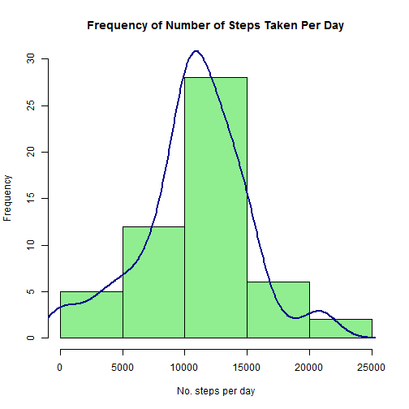
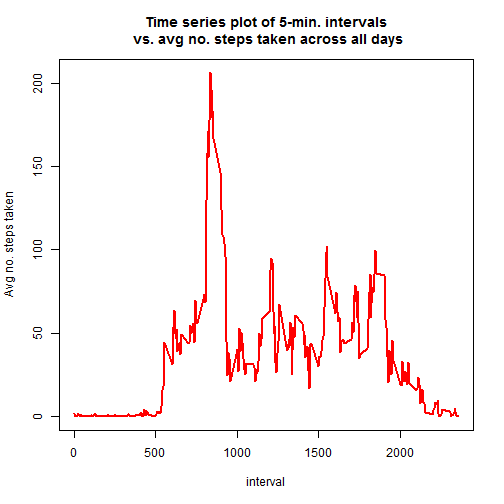
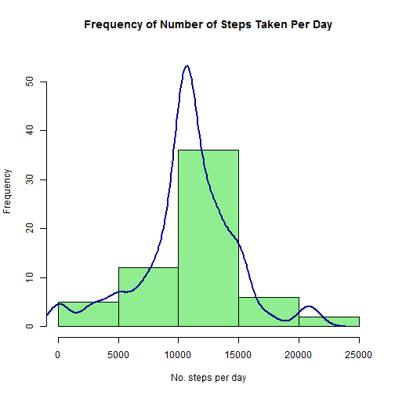
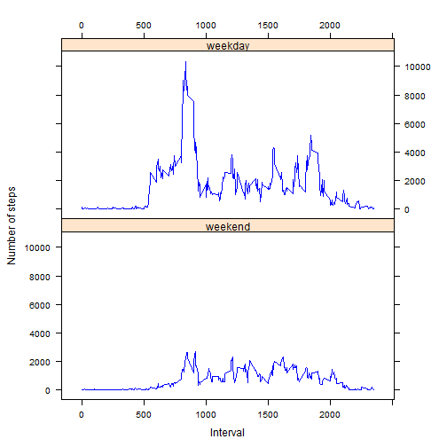

Title: "Reproducible Research: Peer Assessment 1"
==========================================================================================

## Contents
* Loading and preprocessing the data
* What is mean total number of steps taken per day?
* What is the average daily activity pattern?
* Imputing missing values
* Are there differences in activity patterns between weekdays and weekends?


## Loading and preprocessing the data

```r
activity_data <- read.csv("activity.csv")
```


## What is mean total number of steps taken per day?

Start by working out steps per day, using the following code which aggregates steps with date, and sums the steps:


```r
steps_per_day <- aggregate(steps~date, data=activity_data, FUN=sum)
```

Then construct a frequency plot, plus a density curve to show "spread" of the distribution of frequencies:


```r
plot(steps_per_day_hist, col="lightgreen", xlab="No. steps per day", main="Frequency of Number of Steps Taken Per Day", ylim=c(0, 30))
lines(density_number_of_steps, col="darkblue", lwd=2)
```

 

Finally, we work out the mean and median of total number of steps per day. First the mean:


```r
mean(steps_per_day$steps)
```

```
## [1] 10766.19
```

And then the median:


```r
median(steps_per_day$steps)
```

```
## [1] 10765
```


## What is the average daily activity pattern?

To answer this question, start by constructing a time series plot of the 5-minute interval (x-axis) and the average number of steps taken, averaged across all days (y-axis):


```r
avg_steps_per_interval <- aggregate(steps~interval, data=activity_data, FUN=mean)
plot(avg_steps_per_interval$interval, avg_steps_per_interval$steps, type="l", xlab="interval", ylab="Avg no. steps taken", main="Time series plot of 5-min. intervals\n vs. avg no. steps taken across all days", col="red", lwd=2)
```

 

Then, work out the 5-minute interval which, on average across all the days in the dataset, contains the maximum number of steps (use the "which.max" function to find the index of the maximum):


```r
idx <- which.max(avg_steps_per_interval$steps)
interval_with_max_steps <- avg_steps_per_interval[idx,]
interval_with_max_steps
```

```
##     interval    steps
## 104      835 206.1698
```


## Imputing missing values

There are a number of days/intervals where there are missing values (coded as NA). The presence of missing days may introduce bias into some calculations or summaries of the data. The total number of missing values in the dataset (i.e. the total number of rows with NAs) is:


```r
sum(is.na(activity_data))
```

```
## [1] 2304
```

A strategy for filling in all of the missing values in the dataset is to replace the NA for a particular 5-minute interval with the mean across all the data for that interval. To do this, we first create a new dataset that is equal to the original dataset but with the missing data filled in, using the following code, which uses the "ifelse" function to update the "steps" column of the current data set, and where there are NAs, these are replaced with average steps per day (as per the average values data set constructed immediately above):


```r
activity_data$steps <- ifelse(is.na(activity_data$steps), round(avg_steps_per_interval$steps[match(activity_data$interval, avg_steps_per_interval$interval)], digits=0), activity_data$steps)
```

Next, to examine the effect of this strategy, we make a histogram of the total number of steps taken each day for the updated data set (with NAs replaced), and calculate and report the mean and median total number of steps taken per day. 

Now, recalculate steps per day, for the updated data set:


```r
steps_per_day <- aggregate(steps~date, data=activity_data, FUN=sum)
```

Then, re-construct the histogram for raw frequencies, including density curve to show distribution of frequencies:


```r
plot(steps_per_day_hist, col="lightgreen", xlab="No. steps per day", main="Frequency of Number of Steps Taken Per Day", ylim=c(0, 55))
lines(density_number_of_steps, col="darkblue", lwd=2)
```

 

We can see that the density curve has "narrowed", as expected with the increase in total data points.

Finally, we look at the mean and median of total number of steps per day for the updated data set. First the mean:


```r
mean(steps_per_day$steps)
```

```
## [1] 10765.64
```

And then the median:


```r
median(steps_per_day$steps)
```

```
## [1] 10762
```

Regaarding the results: the resulting histogram is largely unchanged, as are the median and mean, but the line measuring the density of frequencies of steps is smoother, narrower, and looks more "normal".


## Are there differences in activity patterns between weekdays and weekends?

First, create a new factor variable in the dataset with two levels - "weekday" and "weekend" indicating whether a given date is a weekday or weekend day.


```r
activity_data$days <- weekdays(as.Date(activity_data$date))
wkday = c("Monday", "Tuesday", "Wednesday", "Thursday", "Friday")
activity_data$daytype <- ifelse(activity_data$days %in% wkday, "weekday", "weekend")
activity_data$daytype <- factor(activity_data$days %in% wkday)
levels(activity_data$daytype)[levels(activity_data$daytype)=="TRUE"] <- "weekday"
levels(activity_data$daytype)[levels(activity_data$daytype)=="FALSE"] <- "weekend"
activity_data_stepsPerInterval <- aggregate(steps~interval+daytype, data=activity_data, FUN=sum)
```

Next, we make a panel plot containing a time series plot of the 5-minute interval (x-axis) and the average number of steps taken, averaged across all weekday days or weekend days (y-axis):


```r
library(lattice)
xyplot(steps ~ interval | daytype, data=activity_data_stepsPerInterval, layout=c(1, 2, 1), type = "l", lwd=1, col.line = "blue", scales=list(x=list(alternating=3)), ylab="Number of steps", xlab="Interval")
```

 

From this, we can see there are clear differences between the activity levels, as well as timings of activity peaks, for weekdays vs. weekends. 
