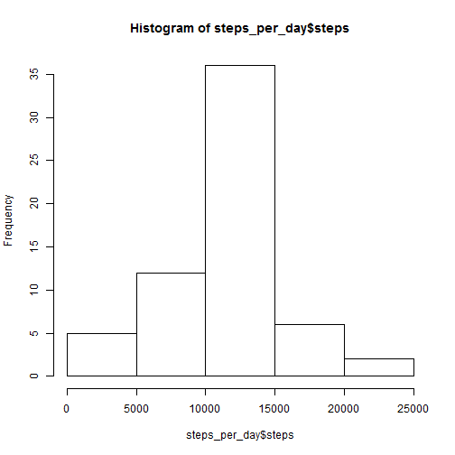

## Loading and preprocessing the data

```r
activity_data <- read.csv("activity.csv")
```


## What is mean total number of steps taken per day?
### Work out steps per day:

```r
steps_per_day <- aggregate(steps~date, data=activity_data, FUN=sum)
```
### First a frequency plot, with density curve included to show "spread" of the distribution of frequencies:


```r
plot(steps_per_day_hist, col="lightgreen", xlab="No. steps per day", main="Frequency of Number of Steps Taken Per Day", ylim=c(0, 30))
lines(density_number_of_steps, col="darkblue", lwd=2)
```

 
### Finally, mean and median of total number of steps per day:

```r
mean(steps_per_day$steps)
```

```
## [1] 10766.19
```

```r
median(steps_per_day$steps)
```

```
## [1] 10765
```


## What is the average daily activity pattern?
### First, here is a time series plot of the 5-minute interval (x-axis) and the average number of steps taken, averaged across all days (y-axis):

```r
avg_steps_per_interval <- aggregate(steps~interval, data=activity_data, FUN=mean)
plot(avg_steps_per_interval$interval, avg_steps_per_interval$steps, type="l", xlab="interval", ylab="Avg no. steps taken", main="Time series plot of 5-min. intervals\n vs. avg no. steps taken across all days", col="red", lwd=2)
```

 
### Next, work out the 5-minute interval which, on average across all the days in the dataset, contains the maximum number of steps:

```r
idx <- which.max(avg_steps_per_interval$steps)
interval_with_max_steps <- avg_steps_per_interval[idx,]
interval_with_max_steps
```

```
##     interval    steps
## 104      835 206.1698
```


## Imputing missing values
### There are a number of days/intervals where there are missing values (coded as NA). The presence of missing days may introduce bias into some calculations or summaries of the data. The total number of missing values in the dataset (i.e. the total number of rows with NAs) is:

```r
sum(is.na(activity_data))
```

```
## [1] 2304
```
### A strategy for filling in all of the missing values in the dataset is to replace the NA for a particular 5-minute interval with the mean across all the data for that interval. To do this, we first create a new dataset that is equal to the original dataset but with the missing data filled in:

```r
activity_data$steps <- ifelse(is.na(activity_data$steps), round(avg_steps_per_interval$steps[match(activity_data$interval, avg_steps_per_interval$interval)], digits=0), activity_data$steps)
```
### Next, to examine the effect of this strategy, we make a histogram of the total number of steps taken each day for the updated data set (with NAs replaced), and calculate and report the mean and median total number of steps taken per day. 
#### First, recalculate steps per day, for the updated data set:

```r
steps_per_day <- aggregate(steps~date, data=activity_data, FUN=sum)
```
#### Next, constructing the histogram for raw frequencies, including density curve to show distribution of frequencies:


```r
plot(steps_per_day_hist, col="lightgreen", xlab="No. steps per day", main="Frequency of Number of Steps Taken Per Day", ylim=c(0, 55))
lines(density_number_of_steps, col="darkblue", lwd=2)
```

 
#### Note that the density curve has "narrowed", which would be expected with the increase in total data points.
#### Finally, mean and median of total number of steps per day for the updated data set:

```r
mean(steps_per_day$steps)
```

```
## [1] 10765.64
```

```r
median(steps_per_day$steps)
```

```
## [1] 10762
```
### The resulting histogram is largely unchanged, but the line measuring the density of frequencies of steps is smoother, narrower, and looks more "normal".


## Are there differences in activity patterns between weekdays and weekends?
### First, create a new factor variable in the dataset with two levels - "weekday" and "weekend" indicating whether a given date is a weekday or weekend day.

```r
activity_data$days <- weekdays(as.Date(activity_data$date))
wkday = c("Monday", "Tuesday", "Wednesday", "Thursday", "Friday")
activity_data$daytype <- ifelse(activity_data$days %in% wkday, "weekday", "weekend")
activity_data$daytype <- factor(activity_data$days %in% wkday)
levels(activity_data$daytype)[levels(activity_data$daytype)=="TRUE"] <- "weekday"
levels(activity_data$daytype)[levels(activity_data$daytype)=="FALSE"] <- "weekend"
activity_data_stepsPerInterval <- aggregate(steps~interval+daytype, data=activity_data, FUN=sum)
```
### Next, we make a panel plot containing a time series plot of the 5-minute interval (x-axis) and the average number of steps taken, averaged across all weekday days or weekend days (y-axis).

```r
library(lattice)
xyplot(steps ~ interval | daytype, data=activity_data_stepsPerInterval, layout=c(1, 2, 1), type = "l", lwd=1, col.line = "blue", scales=list(x=list(alternating=3)), ylab="Number of steps", xlab="Interval")
```

 
